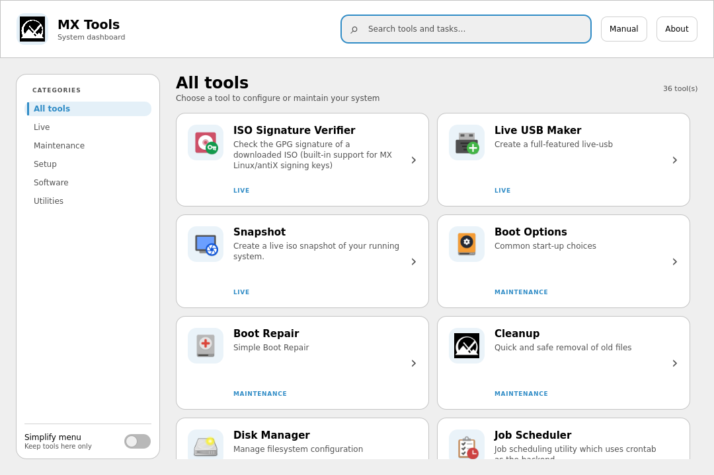

# MX Tools

[](https://repology.org/project/mx-tools/versions)
[](https://software.opensuse.org//download.html?project=home%3Amx-packaging&package=mx-tools)

A Qt6-based dashboard application providing centralized access to configuration tools in MX Linux. MX Tools offers an intuitive graphical interface for launching various system utilities, organized by categories for easy navigation.



## Features

- **Categorized Tool Organization**: Tools are grouped into logical categories (System, Hardware, etc.)
- **Environment-Aware Filtering**: Automatically filters tools based on desktop environment and system state
- **Multi-Language Support**: Comprehensive internationalization with 50+ language translations
- **Modern Qt Quick Interface**: Responsive card dashboard with adaptive navigation and system dark-theme support
- **Live/Installed Detection**: Adapts tool availability based on live vs installed system state

## Architecture

MX Tools is built with C++20 and Qt 6. The platform integration stays in C++, while the interface is declarative QML:

- **ToolModel**: Discovers desktop files, applies environment rules, filters tools, and launches commands
- **Qt Quick UI**: Responsive navigation, search, tool cards, dialogs, and system-palette adaptation
- **Icon provider**: Makes desktop theme icons available to QML cards
- **Resource management**: Embedded QML, application assets, and translation catalogs

## Build Requirements

### Dependencies
- Qt6 Core, QML, Quick, Quick Controls, and LinguistTools
- CMake 3.16 or higher
- Ninja build system
- C++20 compatible compiler (GCC/Clang)

### Debian/Ubuntu
```bash
sudo apt install cmake ninja-build qt6-base-dev qt6-base-dev-tools qt6-declarative-dev qt6-tools-dev qt6-tools-dev-tools
```

## Building

### Quick Build
```bash
# Clone the repository
git clone https://github.com/MX-Linux/mx-tools.git
cd mx-tools

# Build using the provided script
./build.sh
```

### Build Options
```bash
# Debug build
./build.sh --debug

# Use Clang compiler
./build.sh --clang

# Clean build
./build.sh --clean

# Build Debian package
./build.sh --debian
```

### Manual CMake Build
```bash
mkdir build
cd build
cmake -G Ninja -DCMAKE_BUILD_TYPE=Release ..
ninja
```

## Development

### Project Structure
```
mx-tools/
├── src/                   # C++ entry point and application backend
├── qml/                   # Qt Quick window and reusable UI components
├── data/                  # Desktop integration files
├── translations/          # Translation files (.ts)
├── icons/                 # Application icons
├── help/                  # Documentation files
└── debian/               # Debian packaging files
```

### Code Style
- C++20 standard with strict compiler warnings
- Qt6 naming conventions
- Environment-specific code paths for different desktop environments
- Resource-based asset management

## Installation

### From Package
MX Tools is available in MX Linux repositories:
```bash
sudo apt install mx-tools
```

## Contributing

1. Fork the repository
2. Create a feature branch
3. Follow existing code style and patterns
4. Test on different desktop environments
5. Submit a pull request

### Translation Contributions
Please join Translation Forum: https://forum.mxlinux.org/viewforum.php?f=96
Please register on Transifex: https://forum.mxlinux.org/viewtopic.php?t=38671
Choose your language and start translating: https://app.transifex.com/anticapitalista/antix-development


## License

MX Tools is licensed under the GNU General Public License v3.0. See [LICENSE](LICENSE) for details.

## Links

- **Homepage**: https://github.com/MX-Linux/mx-tools
- **Bug Reports**: https://github.com/MX-Linux/mx-tools/issues
- **MX Linux**: https://mxlinux.org
